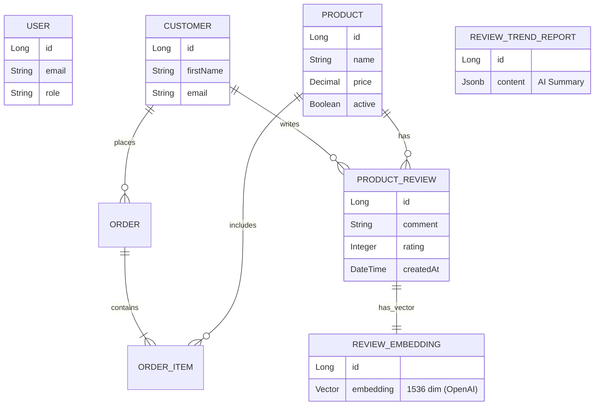

# 📦 AI-Powered Order Management System (OMS)

Ein modernes Order Management System, das über die bloße Verwaltung von Bestellungen hinausgeht. Durch die Integration von **Spring Boot**, **pgvector** und **OpenAI** bietet dieses System tiefgehende Einblicke in Kundenbewertungen durch semantische Suche und KI-generierte Trendanalysen.

-----

## ✨ Highlights & Features

### 🧠 KI-gestützte Analyse (The Core Innovation)

Das Herzstück der Anwendung ist die intelligente Verarbeitung von Kundenfeedback:

  * **Semantische Suche (Vector Search):** Anders als herkömmliche Keyword-Suchen versteht das System den *Kontext*. Eine Suche nach *"schlechte Qualität"* findet auch Bewertungen wie *"ging sofort kaputt"* oder *"Material fühlt sich billig an"*.
      * *Tech:* OpenAI Embeddings (`text-embedding-3-small`) gespeichert in PostgreSQL via `pgvector`.
  * **Trend- & Anomalie-Erkennung:** Das System aggregiert Bewertungen über Zeiträume und generiert mittels LLMs Zusammenfassungen über Qualitätsmängel oder positive Trends (z.B. "Verpackung oft beschädigt").
  * **Sentiment Analysis:** Automatische Einordnung von Feedback in positive, neutrale und negative Cluster.

### 📊 Modernes Dashboard & Analytics

  * **Echtzeit-KPIs:** Umsatzübersicht, Bestellvolumen und aktive Produkte auf einen Blick.
  * **Interaktive Charts:** Visualisierung von Umsatzverläufen und Kategorie-Verteilungen.
  * **Kunden-Insights:** Identifizierung von Top-Kunden und Analyse des Kaufverhaltens.

### 🛠 Robuste Verwaltung

  * Vollständiges Management von **Produkten, Kunden und Bestellungen**.
  * Lagerbestandsüberwachung und Status-Tracking für Bestellungen.

-----

## 📸 Einblicke in die Anwendung

### 1\. Das KI-Trend Center

Hier werden die durch OpenAI analysierten Zusammenfassungen der Kundenstimmen dargestellt. Das System erkennt automatisch Probleme (z.B. "Defekte Produkte") und Highlights.


### 2\. Semantische Bewertungsanalyse

Die Suche ermöglicht das Filtern von hunderten Bewertungen basierend auf ihrer inhaltlichen Bedeutung.


### 3\. Operational Dashboard

Der zentrale Hub für den Shop-Manager mit Live-Daten.


-----

## 🏗 Architektur & Tech Stack

### Frontend (Angular)

  * **Framework:** Angular 16+
  * **Styling:** Modernes Dark-Mode UI (Custom CSS & Chart.js Integration).
  * **Struktur:** Modulares Design (`/products`, `/orders`, `/analytics`).

### Backend (Spring Boot 3)

  * **API:** RESTful Services.
  * **Data Access:** Spring Data JPA & Hibernate.
  * **AI Integration:**
      * `ReviewEmbeddingService`: Generiert Vektoren für neue Bewertungen.
      * `ReviewTrendAnalysisService`: Kommuniziert mit OpenAI für High-Level Reports.
  * **Database:** PostgreSQL mit `pgvector` Extension für hochperformante Ähnlichkeitssuchen (Cosine Similarity).

### 🗂 Datenmodell (ER-Diagramm)

Das Datenmodell ist für relationale Integrität und Vektor-Performance optimiert:



-----

## 🚀 Installation & Setup

### Voraussetzungen

  * Java 17+
  * Node.js & NPM
  * PostgreSQL (mit installierter `vector` Extension)
  * OpenAI API Key

### 1\. Datenbank vorbereiten

```sql
CREATE DATABASE order_management;
\c order_management
CREATE EXTENSION vector;
```

### 2\. Backend starten

```bash
git clone https://github.com/dein-user/order-management.git
cd order-management
# Application.properties anpassen (DB User/Pass, OpenAI Key)
./mvnw spring-boot:run
```

### 3\. Frontend starten

```bash
cd order-management-frontend
npm install
ng serve
```

-----

## 🔮 Roadmap

  * [ ] **Automatisierte E-Mail-Alerts:** Benachrichtigung bei sprunghaftem Anstieg negativer KI-Trends.
  * [ ] **Chatbot:** Ein RAG (Retrieval Augmented Generation) Chatbot für Support-Mitarbeiter, um Fragen zum Bestellstatus oder Produktproblemen zu beantworten.
  * [ ] **Multi-Tenant Support:** Mandantenfähigkeit für mehrere Shops.

-----

Made with ❤️ and ☕ using Spring Boot & Angular.

order-management/src/main/java/com/thomas/order_management/model/**
order-management-frontend/src/app/orders/**
order-management-frontend/src/app/dashboard/**
order-management-frontend/src/app/**/*[Cc]ustomer*
order-management-frontend/src/app/services/**
order-management-frontend/src/app/**/*[Rr]eview*
order-management/src/main/java/com/thomas/order_management/**/*[Oo]rder*.java
order-management/src/main/java/com/thomas/order_management/**/*[Cc]ustomer*.java

