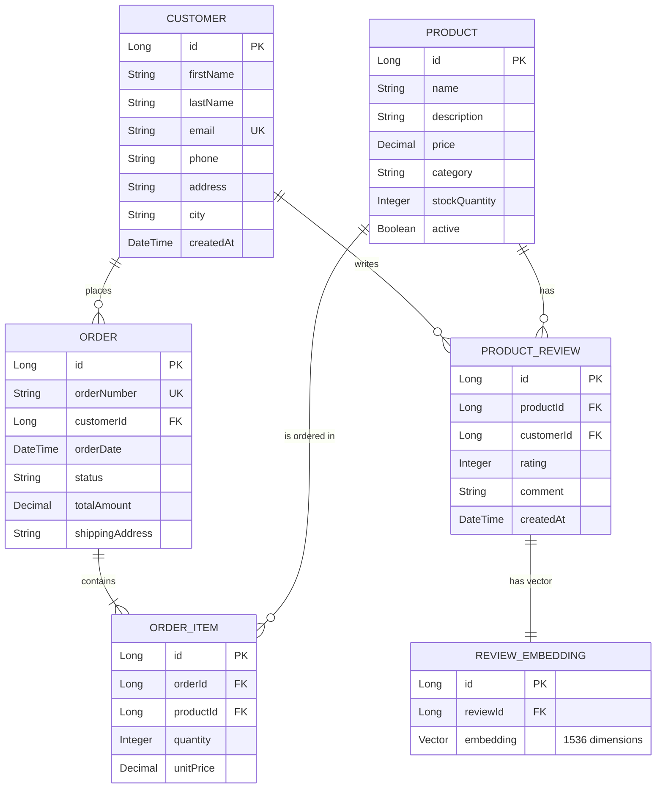

<div align="center">

# 📦 AI-Powered Order Management System

[](https://openjdk.org/)
[](https://spring.io/projects/spring-boot)
[](https://angular.io/)
[](https://www.postgresql.org/)
[](LICENSE)

**Ein modernes Order Management System mit KI-gestützter Analyse von Kundenbewertungen**

[Demo](#-live-demo) • [Features](#-features) • [Tech Stack](#-tech-stack) • [Installation](#-installation) • [API Docs](#-api-dokumentation) • [Architektur](#-architektur)

</div>

---

## 🎯 Über das Projekt

Dieses Order Management System geht über die klassische Bestellverwaltung hinaus. Durch die Integration von **Spring Boot**, **pgvector** und **OpenAI** bietet es tiefgehende Einblicke in Kundenfeedback durch **semantische Suche** und **KI-generierte Trendanalysen**.

### 💡 Warum dieses Projekt?

> *"Kundenfeedback ist Gold wert – aber nur wenn man es versteht."*

Traditionelle Systeme erlauben nur Keyword-Suchen. Dieses System versteht den **Kontext**: Eine Suche nach *"schlechte Qualität"* findet auch Bewertungen wie *"ging sofort kaputt"* oder *"Material fühlt sich billig an"*.

---

## ✨ Features

<table>
<tr>
<td width="50%">

### 🧠 KI-gestützte Analyse
- **Semantische Suche** via Vector Embeddings
- **Trend-Erkennung** durch LLM-Zusammenfassungen
- **Sentiment Analysis** (positiv/neutral/negativ)
- **Anomalie-Detection** für Qualitätsprobleme

</td>
<td width="50%">

### 📊 Dashboard & Analytics
- **Echtzeit-KPIs** (Umsatz, Bestellungen, Kunden)
- **Interaktive Charts** mit Chart.js
- **Kundenanalyse** (Top-Kunden, ABC-Analyse)
- **Umsatzprognosen**

</td>
</tr>
<tr>
<td width="50%">

### 🛒 Order Management
- Vollständiges **CRUD** für Bestellungen
- **Status-Tracking** (Pending → Shipped → Delivered)
- **Bestellhistorie** pro Kunde
- **Umsatzreporting** nach Zeitraum

</td>
<td width="50%">

### 📦 Inventory & Products
- **Lagerverwaltung** mit Stock-Alerts
- **Produktkategorien** und Filterung
- **Bewertungssystem** (1-5 Sterne)
- **Bildverwaltung** für Produkte

</td>
</tr>
</table>

---

## 🛠 Tech Stack

### Backend

| Technologie | Version | Verwendung |
|-------------|---------|------------|
| **Java** | 17 | Programmiersprache |
| **Spring Boot** | 3.4.0 | Framework |
| **Spring Data JPA** | - | ORM / Data Access |
| **Spring Security** | - | Authentifizierung |
| **Spring AI** | 1.0.3 | OpenAI Integration |
| **PostgreSQL** | 15+ | Datenbank |
| **pgvector** | - | Vector Similarity Search |
| **Liquibase** | - | Database Migrations |
| **MapStruct** | 1.5.5 | DTO Mapping |
| **Lombok** | 1.18.34 | Boilerplate Reduction |
| **Maven** | 3.9+ | Build Tool |
| **JUnit 5** | - | Unit & Integration Tests |
| **OpenAPI/Swagger** | 2.7.0 | API Documentation |

### Frontend

| Technologie | Version | Verwendung |
|-------------|---------|------------|
| **Angular** | 19 | Framework |
| **TypeScript** | 5.x | Programmiersprache |
| **Chart.js** | - | Datenvisualisierung |
| **RxJS** | - | Reactive Programming |

### DevOps & Tools

| Technologie | Verwendung |
|-------------|------------|
| **Docker** | Containerization |
| **Git** | Version Control |
| **GitHub Actions** | CI/CD (optional) |
| **Heroku** | Cloud Deployment |

---

## 🏗 Architektur

```
┌─────────────────────────────────────────────────────────────────┐
│                         FRONTEND                                │
│                    Angular 19 (TypeScript)                      │
│   ┌──────────┐  ┌──────────┐  ┌──────────┐  ┌──────────┐      │
│   │Dashboard │  │ Orders   │  │ Products │  │ Reviews  │       │
│   └────┬─────┘  └────┬─────┘  └────┬─────┘  └────┬─────┘      │
└────────┼─────────────┼─────────────┼─────────────┼─────────────┘
         │             │             │             │
         └─────────────┴─────────────┴─────────────┘
                              │
                         REST API
                              │
┌─────────────────────────────┼───────────────────────────────────┐
│                         BACKEND                                 │
│                    Spring Boot 3.4                              │
│                                                                 │
│  ┌─────────────────────────────────────────────────────────┐   │
│  │                    Controller Layer                      │   │
│  │  OrderController │ CustomerController │ ReviewController │   │
│  └─────────────────────────────────────────────────────────┘   │
│                              │                                  │
│  ┌─────────────────────────────────────────────────────────┐   │
│  │                    Service Layer                         │   │
│  │  OrderService │ CustomerService │ ReviewEmbeddingService │   │
│  │                    ReviewTrendAnalysisService            │   │
│  └─────────────────────────────────────────────────────────┘   │
│                              │                                  │
│  ┌─────────────────────────────────────────────────────────┐   │
│  │                   Repository Layer                       │   │
│  │          Spring Data JPA │ Custom Queries                │   │
│  └─────────────────────────────────────────────────────────┘   │
│                              │                                  │
└──────────────────────────────┼──────────────────────────────────┘
                               │
┌──────────────────────────────┼──────────────────────────────────┐
│                         DATABASE                                │
│                     PostgreSQL + pgvector                       │
│                                                                 │
│   ┌──────────┐  ┌──────────┐  ┌──────────┐  ┌───────────────┐ │
│   │Customers │  │ Orders   │  │ Products │  │ReviewEmbeddings│ │
│   └──────────┘  └──────────┘  └──────────┘  │  (Vector 1536) │ │
│                                             └───────────────┘ │
└─────────────────────────────────────────────────────────────────┘
                               │
┌──────────────────────────────┼──────────────────────────────────┐
│                      EXTERNAL SERVICES                          │
│                                                                 │
│   ┌─────────────────────────────────────────────────────────┐  │
│   │                    OpenAI API                            │  │
│   │  • text-embedding-3-small (Vector Generation)           │  │
│   │  • gpt-4o-mini (Trend Analysis & Summaries)             │  │
│   └─────────────────────────────────────────────────────────┘  │
└─────────────────────────────────────────────────────────────────┘
```

### 🗂 Datenmodell (ER-Diagramm)



---

## 🚀 Installation

### Voraussetzungen

- ☕ **Java 17+** ([Download](https://adoptium.net/))
- 📦 **Maven 3.9+** ([Download](https://maven.apache.org/download.cgi))
- 🐘 **PostgreSQL 15+** mit `pgvector` Extension
- 🟢 **Node.js 18+** & npm ([Download](https://nodejs.org/))
- 🔑 **OpenAI API Key** ([Get Key](https://platform.openai.com/api-keys))

### 1️⃣ Repository klonen

```bash
git clone https://github.com/Thomas7899/order-management-app.git
cd order-management-app
```

### 2️⃣ Datenbank einrichten

```sql
-- PostgreSQL
CREATE DATABASE order_management;
\c order_management
CREATE EXTENSION IF NOT EXISTS vector;
```

**Oder mit Docker:**

```bash
cd order-management
docker-compose up -d postgres-dev
```

### 3️⃣ Backend starten

```bash
cd order-management

# OpenAI API Key setzen
export OPENAI_API_KEY=sk-your-api-key

# Anwendung starten
./mvnw spring-boot:run
```

> 📍 Backend läuft auf: **http://localhost:8080**  
> 📖 API-Docs: **http://localhost:8080/swagger-ui.html**

### 4️⃣ Frontend starten

```bash
cd order-management-frontend

# Dependencies installieren
npm install

# Development Server starten
ng serve
```

> 📍 Frontend läuft auf: **http://localhost:4200**

---

## 📖 API Dokumentation

Die vollständige API-Dokumentation ist via **Swagger UI** verfügbar:

🔗 **http://localhost:8080/swagger-ui.html**

### Wichtige Endpoints

| Methode | Endpoint | Beschreibung |
|---------|----------|--------------|
| `GET` | `/api/orders` | Alle Bestellungen abrufen |
| `POST` | `/api/orders` | Neue Bestellung erstellen |
| `GET` | `/api/orders/{id}` | Bestellung nach ID |
| `PATCH` | `/api/orders/{id}/status` | Bestellstatus ändern |
| `GET` | `/api/customers` | Alle Kunden abrufen |
| `GET` | `/api/customers/search?query=` | Kunden suchen |
| `GET` | `/api/products` | Alle Produkte abrufen |
| `GET` | `/api/reviews/similar?query=` | Semantische Suche |
| `GET` | `/api/dashboard/stats` | Dashboard KPIs |

### Beispiel: Bestellung erstellen

```bash
curl -X POST http://localhost:8080/api/orders \
  -H "Content-Type: application/json" \
  -d '{
    "customer": {"id": 1},
    "orderItems": [
      {"product": {"id": 1}, "quantity": 2}
    ]
  }'
```

---

## 🧪 Tests

```bash
cd order-management

# Alle Tests ausführen
./mvnw test

# Spezifische Test-Klasse
./mvnw test -Dtest="OrderServiceTest"

# Mit Coverage Report
./mvnw test jacoco:report
```

### Test-Struktur

```
src/test/java/
├── service/
│   ├── OrderServiceTest.java        # 13 Unit Tests
│   └── CustomerServiceImplTest.java # 11 Unit Tests
└── repository/
    └── OrderRepositoryTest.java     # 11 Integration Tests
```

---

## 🐳 Docker

```bash
# Komplettes Setup mit Docker Compose
docker-compose up -d

# Nur Datenbank
docker-compose up -d postgres-dev

# Logs anzeigen
docker-compose logs -f
```

---

## 📁 Projektstruktur

```
order-management-app/
├── 📂 order-management/              # Backend (Spring Boot)
│   ├── 📂 src/main/java/
│   │   └── com/thomas/order_management/
│   │       ├── 📂 config/            # Konfigurationen (Security, OpenAPI, etc.)
│   │       ├── 📂 controller/        # REST Controller
│   │       ├── 📂 dto/               # Data Transfer Objects
│   │       ├── 📂 exception/         # Exception Handling
│   │       ├── 📂 mapper/            # MapStruct Mapper
│   │       ├── 📂 model/             # JPA Entities
│   │       ├── 📂 repository/        # Spring Data Repositories
│   │       └── 📂 service/           # Business Logic
│   ├── 📂 src/main/resources/
│   │   ├── 📂 db/changelog/          # Liquibase Migrations
│   │   └── application.properties
│   ├── 📂 src/test/                  # JUnit Tests
│   ├── docker-compose.yml
│   └── pom.xml
│
├── 📂 order-management-frontend/     # Frontend (Angular)
│   ├── 📂 src/app/
│   │   ├── 📂 components/
│   │   ├── 📂 services/
│   │   └── 📂 types/
│   ├── angular.json
│   └── package.json
│
└── 📂 docs/                          # Dokumentation
```

---

## 🔮 Roadmap

- [ ] 📧 **E-Mail-Alerts** bei negativen Trend-Spikes
- [ ] 🤖 **RAG Chatbot** für Support-Anfragen
- [ ] 🏢 **Multi-Tenant Support** für mehrere Shops
- [ ] 📱 **Mobile App** (Flutter/React Native)
- [ ] 🔐 **OAuth2/JWT** Authentifizierung
- [ ] 📈 **Erweiterte Analytics** mit Machine Learning

---

## 🤝 Contributing

Beiträge sind willkommen! Bitte lies zuerst die Contributing Guidelines.

1. Fork das Repository
2. Erstelle einen Feature Branch (`git checkout -b feature/AmazingFeature`)
3. Committe deine Änderungen (`git commit -m 'Add some AmazingFeature'`)
4. Push zum Branch (`git push origin feature/AmazingFeature`)
5. Öffne einen Pull Request

---

## 📄 Lizenz

Dieses Projekt ist unter der MIT-Lizenz lizenziert - siehe [LICENSE](LICENSE) für Details.

---

<div align="center">

**Made with ❤️ and ☕ by Thomas Osterlehner**

[](https://github.com/Thomas7899)

</div>

